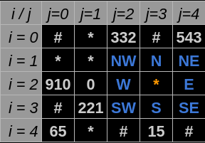
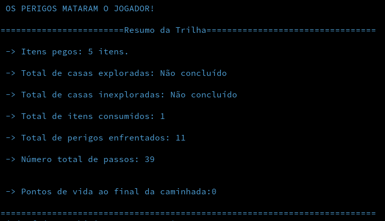
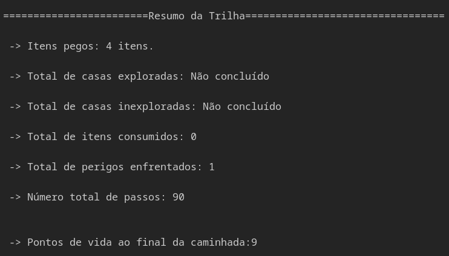

<!--Idea!! CITAR O NÍVIO ZIVIANI-->
<!--DÚVIDAS!!
    1. Pedir um feedback geral tanto do código quanto do readme.
    2. Perguntar se as minhas referências estão sendo realizadas da maneira correta.
    3. Tá grande de mais?
    remember the font: https://www.iconexperience.com/o_collection/search/?q=graph
-->

# O Algoritmo Guloso - Percorrento um Labirinto Recorrente

#### Algoritmos e Estrutura de Dados

#### Compatibilidade e Desenvolvimento
 

  

  
## Introdução
Este repositório apresenta a solução implementada para um desafio da disciplina de Algoritmos e Estruturas de Dados. Assim como foi realizado no primeiro trabalho da disciplina (Greedy Algorithm) esta é uma proposta de implementar um algoritmo que resolva um problema de forma gulosa, contudo um problema diferente da primeira proposta. Para isso considere as seguintes colocações:

- Nomes de diretórios, ou arquivos serão referênciados da seguinte forma: `Nome.txt` ou `Diretório_2`.

- $K$ - Número de matrizes de entrada presentes no arquivo `input.data`.

- $N$ - Ordem das matrizes sendo representada pelos 2 primeiros números da primeira linha do arquivo `input.data`, portanto o código já espera que $N \in \mathbb{Z}$ e $N\geq 0$ e não trata essa variável.

- $i$ - Índice de uma linha que pertence à uma matriz específica, também pode ser abstraído como deslocamento na vertical, tal que $i \geq 0$ e $i \in \mathbb{Z}$.

- $j$ - Índice de uma coluna que pertence à uma matriz específica, também pode ser abstraído como deslocamento na horizontal, tal que $j \geq 0$ e $j \in \mathbb{Z}$.

- $a_{ij}$ - Elemento encontrado quando há deslocamento até a linha de índice $i$ e coluna de índice $j$.

- _Tralha ou jogo da velha_ - **Parede**: Local onde não se pode passar dentro de uma matriz.

- $*$ - **Perigo**: Local onde ao se passar haverá descrescimento em 1 da variável vida.

- $a_{ij}$ - Elemento encontrado quando há deslocamento até a linha de índice $i$ e coluna de índice $j$.

-   $A$ - Caso favorável.

-   $n(A)$ - Número de casos favoráveis.

-   $n(U)$ - Número de casos possíveis.

-   $P(A)$ - Probabilidade de um caso favorável $A$.

- Nomes de comandos digitados no terminal,funções ou variáveis serão referênciados da seguinte forma: _**touch main.cpp**_, _**make run**_, __**ShowResults()**__, __**variableA**__.

- Para as **Figuras** de **1** à **x**, considere a legenda de cores:

    -   Azul:Uma posição futura possível.</kbd>
    -   Cinza: Uma posição futura impossível.
    -   Laranja: Posição atual ou inicial.
    -   Rosa: Posição futura escolhida.

### Contextualizando o Algoritmo
- Para contextualizar o funcionamento do algoritmo aqui foram escolhida Considere a existencia de um personagem muito ambicioso este viaja através de labirintos em busca de itens. Sua ambição é tamanha que viajará até coletar o máximo de itens escondidos pelo caminho possível. Para isso o ambicioso caminha sem parar até que uma das proposições à seguir sejam verdades.:
    -   O personagem inicia sua viajem com $10$ pontos de vida.
    -   A parede representa uma casa por onde o ambicioso não consegue passar.
    -   O caracter $*$ representa uma casa por onde caso o ambicioso passe, haverá descrescimento de um ponto de vida do mesmo. Denomina-se o $*$ como perigo.
    -   O personagem morre de pânico ao realizar uma viajem partindo de um ponto $a_{ij}$ e retornando ao mesmo com $a_{ij}$, sem que haja encontrado nenhum item em seu percurso sendo $a_{ij}$ uma casa de valor 0 quando considerada o primeiro passo do circuito.
    -   Cada casa tem um item de valor específico.
    -   Quando o jogador anda por 4 casas com itens de valor diferente de $0$ ele recebe $1$ ponto de vida.
    -   O personagem morre ao enfrentar o número de perigos que o leve a ter pontos de vida igual a $0$.

-   *Alternativa de abordagem:* Percursos ou circuitos podem representar conceitos mais completos ao se tratar de relações entre abstrações com informações. Os Grafos são a trativa adequada para resolver esse tipo de problema, definidos como estruturas formadas por objetos que apresentam uma relação comum, abrangem muitos problemas. Caso haja interesse em modelar os conceitos contextualizados nessas estruturas, é valida à consulta dos seguintes links: <a href = " " >Aula em português</a> , <a href = " " >Leitura</a> e <a href="https://graphonline.ru/pt/">Modelagem e experimentação</a>;

######  *Nota de leitura*: À partir daqui considere a tratativa do termo labirinto como o termo matriz, bem como as casas como elementos pertencentes à mesma, e a viajem realizada sendo representada através da leitura e escrita do arquivo `input.data`.

  
## Objetivo Específicos
A problemática proposta incita os alunos da disciplina a desenvolverem um programa que leia $K$ matrizes de ordem $N$. Considerando essa proposição algumas exigências de desenvolvimento solicitadas foram:

- As matrizes deverão estar préviamente organizadas para processamento em um arquivo `input.data`.

- A pesquisa ou percorrimento na matriz iniciará preferencialmente à partir de um arquivo e quando necessário deve-se gerar dados de entrada automáticos. A entrada representará tanto o ponto inicial  para percorrer as matrizes, quento os valores de ${K}$ e ${N}$.

- Os movimentos válidos para deslocamento pela matriz são listados à seguir e visualizados de azul na Figura 1, considerando o ponto de partida atual sendo o elemento colorido de laranja:
    

    - Retroceder para a coluna anterior.
    
    - Avançar para a próxima coluna.

    - Retroceder para a linha anterior.
    
    - Avançar para a próxima linha.
    
    - Avançar em diagonal esquerda, ou direita para baixo.

    - Avançar em diagonal esquerda, ou direita para cima.

    - Avançar em diagonal direita, ou direita para baixo.

    - Avançar em diagonal direita, ou direita para cima.

- A coluna de valor $N$ faz com que o personagem troque da matriz em que ele está para a matriz próxima matriz do arquivo.

<strong>Figura 1</strong> - Escolha de inicialização    
 

 
Fonte: Construção pelo autor¹.
 
____________________________________________
 ¹Criada usando o Google Sheets, Disponível em <a href="https://docs.google.com/spreadsheets/d/1nbK5ybx7Lwp98y11IScqkPUhSizV1jwG1KyGsdvTEjI/edit#gid=0">Planilha</a>.

 

- Cada desenvolvedor do projeto escolhe propostas de inicialização e percorrimento diferentes, em função disso as seguintes premissas se fazem necessárias para compreensão da escolhida neste projeto.

- O ponto inicial deve ser escolhido de maneira aleatória, seguindo uma probabilidade de escolha distribuída entre as casas azuis.

-   Em primeiro lugar para cálculo da probabilidade de escolha de um caso descobre-se o valor da divisão entre a escolha de um caso favorável e os casos possíveis. Isso pode ser representado das seguinte maneira:
    -   $P(A) = \frac{n(A)}{n(U)}$

- No caso da Figura 1, sendo A uma escolha de que a casa inicial seja $i=2$ e $j = 2$, as seguintes proposições são verdadeiras:
    - Casas onde $j=N$ não são posições válidas de inicialização.
    - Casas com o caracter que representam uma parede não são escolhas possíveis.
    - Existem $5$ caracteres que representam uma parede.
    - $n(U) = 15$
    - $n(A) = 1$.
    - $P(A) \approx 6,6666\%$

<strong>Figura 2</strong> - Escolha de caminhamento    
 

 
Fonte: Construção pelo autor¹.
 
____________________________________________
 ¹Criada usando o Google Sheets, Disponível em <a href="https://docs.google.com/spreadsheets/d/1nbK5ybx7Lwp98y11IScqkPUhSizV1jwG1KyGsdvTEjI/edit#gid=0">Planilha</a>.

 

- Os movimentos devem ser realizados de maneira aleatória, seguindo uma probabilidade de escolha distribuída entre as casas azuis. Com isso seriam elementos possível para deslocamento os elementos contidos no conjunto $F$ para $F =  \text \{$ $a_{11}, a_{12}, a_{13}, a_{23}, a_{33}, a_{32}, a_{31}, a_{21}$ $\text \}$. Portanto: 
    - $P(a_{ij}) \approx 12,5\%$ tal que $a_{ij} \in F$

- Ao ter como posição atual o elemento de uma matriz posicionado na última coluna, ou seja, com $j = N$ o personagem troca para a próxima matriz.

  
<!--Prioridade alta-->
## Solução
### Arquivos
Os arquivos para funcionamento do projeto são:
- `input.data` : Um arquivo que armazena na sua primeira linha a ordem das matrizes que estão dispostas nas linhas subsequentes.

<strong>Figura 3</strong> - input.data    
 

 
Fonte: Captura de tel feita pelo autor².
 
____________________________________________
 ²Captura de tela do computador do autor. Disponível em: <a href="https://github.com/jAzz-hub/Recurrent_Labyrinth/blob/main/img/Imagem3.png">Imagem 3</a>.

 

- `Makefile` : Controla a geração dos executáveis e compilação dos mesmos(FREE SOFTWARE FOUNDATION, GNU make, 2023).

- `ReadFunctions.cpp` : Conteḿ as funções criadas para leitura da primeira linha do arquivo `input.data`.

- `ReadSignature.hpp` : Conteḿ as assinaturas das funções criadas para leitura da primeira linha do arquivo `input.data`.

- `functions.cpp` : Contém as funções criadas para execução no `main.cpp` e no próprio `functions.cpp`.

- `structures.hpp` : Contém as estruturas e chamadas de bibliotecas utilizadas e assinaturas das funções do programa.

- `main.cpp` : Contém uma série de funções e declaração de variáveis que façam com que a busca pela matriz seja realizada devidamente.
  
### Funcionamento
#### 1. Primeira Leitura do Arquivo
 A leitura das entradas do arquivo `input.data` é realizada apenas 1 vez, em primeiro lugar o código reconhece qual a ordem da matriz e quantas matrizes estarão presentes no arquivo de entrada, isso será realizado respectivamente pelas funções _**SizeRecon**_ e _**HowMuchMatrixes**_.

 A função SizeRecon é responsável por ler a primeira linha do arquivo de entrada e retornar $N$, este valor serve para todas as $K$ matrizes contidas no arquivo `input.data`.

#### 2. Armazenando dados do Arquivo.
 Com os valores de $N$ e $K$ sendo fornecidos pelas funções como foi colocado, uma estrutura de tamanho $N$ do tipo _**Matrix**_ denominada _**MatrixLabyrinth**_ é criada para que os valores do arquivo `input.data` ou `Output.data` sejam alocados em uma variável conforme as leituras e escritas ocorram de forma recorrente. A estrutura do tipo _**Matrix**_ possui atributos importantes mas o principal para continuar nosso entendimento a cerca do código é um vetor alocado dinâmicamente chamado _***Labyrinth**_, ou seja, a matriz que armazena os valores $a_{ij}$ contidos no arquivo.

Para a leitura das $K$ matrizes um laço percorre o arquivo armazenando cada elemento identificado em uma posição da estrutura _**Labyrinth**_, essa mesma estrutura é reiniciada assim que: _**MatrixLines**_  =  $N-1$ . Considerando que _**MatrixLines**_ é uma variável criada para armazenar o número de linhas preenchidas com entradas do arquivo.

 
#### 3. Percorrendo Matrizes:

#### 3.1. Localização inicial
Diante do que foi narrado, o programa gera coordenadas de $i$ e $j$ aleatoriamente para inicializar a pesquisa através da martriz partindo do elemento $a_{ij}$. A função _**Spawn**_ gera aleatoriamente os valores de $i$ e $j$ para dar início ao percorrimento da matriz.

#### 3.2. Direções possíveis
O programa usa $a_{ij}$ como posição em que está no presente, ele verifica a resposta para a seguinte pergunta:
- As posições adjascentes correspondem à espaços da memória alocados pela matriz?

A validação citada ocorre através do seguinte modo:

- Criação de hipóteses dentro de variáveis booleanas,sendo o resultado dessas variáveis é dependente da posição atual.As variáveis booleanas criadas tem os nomes de pontos cardeais em inglês, são elas _**N**_,_**NE**_,_**NW**_,_**W**_,_**SW**_,_**S**_,_**SE**_,_**E**_ e podem ser verdadeiras ou falsas de maneiras diferentes tornando diversos caminhos possíveis. 

Por fim pode-se abstrair a situação acima nas seguintes ilustrações, considerando que o elemento de cor laranja é o local atual:

<strong>Figura 4</strong> - 8 possíveis caminhos    
 

 
Fonte: Construção pelo autor⁴.
 
____________________________________________
 ⁴Criada usando o Google Sheets, Disponível em <a href="https://docs.google.com/spreadsheets/d/1nbK5ybx7Lwp98y11IScqkPUhSizV1jwG1KyGsdvTEjI/edit?usp=sharing">Planilha</a>.

 

#### 3.3. Escolha entre Direções Locais:
Após analisar as hipóteses, a decisão de qual caminho seguir é realizada através da escolha de coordenadas possíves, sendo elas definidas pela função _**CoordinateDefinition**_. Uma vez que o personagem escolhe uma nova coordenada, seus atributos são alterados pela função _**PlayerAndLabyrinthUpdate**_.

- _**CoordinateDefinition**_: Escolhe uma casa adjascente aleatória para caminhamento. Essa escolha é realizada de forma repetida até que o valor da coordenada escolhida esteja alocada pela matriz e seja diferente de uma parede.

- _**PlayerAndLabyrinthUpdate**_: Adiciona passos ao contador de passos, contabiliza itens na inventário para aumento de pontos de vida, descrementa pontos de vida ao enfrentar um perigo e atualiza atributos da Rotunda.

<strong>Figura 5</strong> - Validando as coordenadas válidas para deslocamento, sendo elas  Noroeste, Norte e Nordeste
 

 
Fonte: Construção pelo autor⁵.
 
____________________________________________
 ⁵Criada usando o Google Sheets, Disponível em <a href="https://docs.google.com/spreadsheets/d/1nbK5ybx7Lwp98y11IScqkPUhSizV1jwG1KyGsdvTEjI/edit?usp=sharing">Planilha</a>.

 

#### 3.4. Trocando de Matriz
No momento em que o personagem alcança a última coluna da matriz local a função _**FileUpdate**_ escreve as alterações da matriz local durante a caminhada em um arquivo `Output.data` e o personagem começa a realizar o percorrimento da próxima matriz.

- Quando o jogador alcança a última coluna da última matriz presente em no arquivo `input.data`, a função _**FileUpdate**_ passa a realizar a leitura e escrita dentro do arquivo `Output.data`.

#### 3.5. Casos Especiais
Existem alguns casos particulares onde teremos uma derrota causada por motivos diversos:

- Quando o jogador inicia uma trajetória que em algum momento passa pelo mesmo ponto onde ela começou sendo que este não capturou nenhum item, o jogo é perdido. Para computar essa derrota foram criadas as funções e estruturas de dados à seguir:

    - _**Roundabout**_: Roundabout ou Rotunda é um item no inventário do jogador, esse vetor passa a armazenar as coordenadas percorridas por um jogador à partir do momento que ele passa a viajar por casas de valor $0$, o item armazena uma coordenada por matriz e é esvaziado caso o jogador pegue um item tendo de ser preenchido de novo. Isso foi modelado de maneira ilustrativa por um vetor, este vetor tem como tamanho o número de matrizes contidas no arquivo `input.data`;

    - _**UpdatingPlayerRoundabout**_: Função que atualiza os valores na Rotunda, preenchendo-a caso o jogador pegue um zero em uma matriz onde ele não pegou esse valor ainda, ou esvaziando-a caso o jogador pegue um item. Caso a Rotunda esteja completamente preenchida o atributo _**WinCondition**_ do jogador se torna falso e ele é morto pela função _**GameOver**_.

    - _**MatrixNotOnRoundabout**_: Função que verifica se as coordenadas da matriz atual já foram armazenadas na Rotunda, ou seja, se o jogador já pegou $0$ na matriz atual ou não.

    - _**RestartRoundabout**_: Função que esvazia a Rotunda quando o jogador pega um item.

    - Ao se considerar um caso com $K = 2$ com $N = 5$, onde em algum momento o trajeto sinalizado é realizado, tendo o ponto inicial na primeira matriz como $a_{20}$ e o ponto final como $a_{20}$ na primeira matriz, pode-se conceber um caso onde o jogador morre por preenchimento da rotrunda. Acompanhe o exemplo na imagem à seguir:

<strong>Figura 6</strong> - Casa inicial ou presente é igual casa final.    
 

 
Fonte: Construção pelo autor⁶.
 
____________________________________________
 ⁶Criada usando o Google Sheets, Disponível em <a href="https://docs.google.com/spreadsheets/d/1nbK5ybx7Lwp98y11IScqkPUhSizV1jwG1KyGsdvTEjI/edit?usp=sharing">Planilha</a>.

 

- Quando o jogador enfrenta perigos os suficientes para ficar sem pontos de vida ele também é derrotado. Vale ressaltar que a função _**GameOver**_ verifica essas condições de derrota à cada iteração realizada pelo algoritmo.
    - _**GameOver**_: Função que faz um teste para avalizar se o jogador pode ser morto por preenchimento da Rotunda, ou se foi derrotado por perder todos os pontos de vida. Caso a derrota venha a ocorrer o relatório _**ResumeOfJourney**_ é chamado.

    - _**ResumeOfJourney**_: Função que mostra tentativas de mensurar dados sobre a viajem do personagem. São essas informações: quantas casas foram percorridas ao todo, qual a soma dos itens consumidos pelo caminho, quantas casas da matriz ficaram sem serem exploradas, quantos perigos foram enfrentados ao decorrer do percurso.

## Implementação
Em função de representar o que é realizado pelo algoritmo diante da entrada específica em <a href="dataset/input.data">`input.data`</a>, observe as imagens abaixo.

<strong>Figura 7</strong> - Entrada 1
 

 
  

<strong>Figura 8 - </strong>
Saída de dados Entrada 1
 

 
 

<strong>Figura 9</strong> - Entrada de dados Matriz 2
 

 
  
<strong>Figura 10 - </strong>
Saída de dados da Entrada 2
 

 
 
Fonte: Captura de tela da compilação e execução realizada na máquina do autor ⁷⁻¹⁰.
 
____________________________________________
 ⁷⁻¹⁰Criada Pela Compilação do código fonte, Disponível em <a href="./src">Código Fonte</a>.

 

## Reflexões e Aprendizados

### Como melhorar o desenvolvimento de algoritmos?
Diante do conhecimento proposto em salas aula após a construção do <a href ="https://github.com/jAzz-hub/Greedy_Algorithm/tree/main/src"> primeiro algoritmo guloso </a> a turma de Algoritmos e Estruturas de Dados 1 aprendeu sobre como calcular custo de suas aplicações. Dito isso foi proposto que houvesse a tentativa de realizar a modelagem de custo assintótico do algoritmo construído. Essa abordagem é importante, pois propõe questionamentos diante das melhores maneiras de se resolver um problema, ou seja, se há como melhorar o desenvolvimento de algorimtos. Portanto a resposta é testando outros algoritmos que tenham o mesmo propósito na mesmo ambiente de desenvolvimento e mensurando variáveis que interferem no quão "bom" pode ser o algoritmo resolvido, afinal "bom" é algo muito subjetivo.

### Análise de Algoritmos Aleatorizados é o caso desse projeto?

Percebendo a recorrência de fenômenos probabilisticos no comportamento do projeto desenvolvido, foi percebido pela turma que a análise poderia se fazer complexa o suficiente para estar fora do escopo de entrega do trabalho.

Apesar da aplicação dos métodos de análise assintótica probabilística não serem o completo foco do trabalho, foi descoberto que são formas essênciais de se examinar o comportamento do programa desenvolvido.

_"De modo geral dizemos que um algoritmo é **aleatorizado** se seu comportamento for determinado não apenas por sua entrada, mas também por valores produzidos por um **gerador de números aleatórios**"_(CORMEN, 2012, p.108).

A citação acima prova que o caso desenvolvido se classifica como um algoritmo aleatorizado, afinal as entradas do código fonte são produzidas por um gerador de números aleatórios, denominei a função que gera números aleatórios contidos em um intervalo como _**RandomGenerator**_. À seguir também é importante considerar que:

_"Quando analisamos o tempo de execução de um algoritmo aleatorizado, adotamos a expectativa do tempo de
execução para a distribuição de valores retornada pelo gerador de números aleatórios. Distinguimos esses algoritmos
daqueles, cuja entrada é aleatória referindo-nos ao tempo de execução de um algoritmo aleatorizado como um tempo
de execução esperado. Em geral, discutimos o tempo de execução do caso médio quando a distribuição de
probabilidade refere-se às entradas do algoritmo, e discutimos o **tempo de execução esperado** quando o próprio
algoritmo faz escolhas aleatórias."_(CORMEN, 2012, p.108).

Com isso Concluí-se que ao pensar na análise probabilistica não é apenas a modelagem de combinações ou probabilidades que influenciarão na análise assintótica, os próprios códigos escritos para gerar entradas aleatórias, ou seja, analisar o custo da função _**RandomGenerator**_ importa. É trivial mas válido pensar que para isso teríamos que analisar os custos das funções que são usadas dentro delas, algumas de difícil acesso à documentação.

 
<strong>Algoritmos: teoria e prática, de Thomas H. Cormen, Charles E. Leiserson, Ronald L. Rivest e Clifford Stein, tradução da 3ª edição</strong>

### Reavaliando a Implementação de um Algoritmo Guloso
Foi implementado um algoritmo guloso simular as propostas de caminhamento por labiritntos, porém é válido ressaltar que uma abordagem à partir da modelagem computacional com <a href = "https://www.youtube.com/watch?v=k9DJn-COtKg">grafos</a> também poderia solucionar o problema. No entando se apegando ao que foi compreendido como recurso computacional até o momento e tentando aperfeiçoar o desenvolvimento de algoritmos gulosos, o projeto foi realizado desta forma.

Considerando isso, são propostos por Cormen(2012) os Elementos da Estratégia Gulosa. Apesar das estratégias citadas serem ótimas formas de realizar o trabalho neste projeto a análise de casos onde é necessário saber todas as casas por onde se passou, bem como as casas por onde não se passou não foram desenvolvidas isso denota uma falha do autor na tentativa de implementação dos algoritmos gulosos. Para acessar as estratégias, clique no link abaixo:

- <a href="https://github.com/jAzz-hub/Greedy_Algorithm#reavaliando-a-implementa%C3%A7%C3%A3o-de-um-algoritmo-guloso">Estratégias</a>

 
 

## Compilação e Execução

Para compilação e execução do código é necessário que seja criado um arquivo Makefile. Para uso deste arquivo da forma correta, siga as diretrizes de execução abaixo:

<table>

<tr>
<td colspan = '1'><strong>Comandos</strong></td>
<td align = "center" colspan = '1'><strong>Funções</strong></td>
</tr>

<tr>
<td align="center"><strong><i>make clean</i></strong>
</td>
<td align="center">Deleta o arquivo executável e todos os arquivos objetos do diretório. (FREE SOFTWARE FOUNDATION, GNU make, 2023)</td>
</tr>
<tr>
<td align="center"><strong><i>make</i></strong></td>
<td align="center">Compila diferentes partes do programa através do g++ e cria um arquivo executável na pasta build. </td>
</tr>
<tr>
<td align="center"><strong><i>make run</i></strong></td>
<td align="center">Executa o programa da pasta build após a realização da compilação. (PIRES, MICHEL, 2023)</td>
</tr>
</table>

## Ambiente de desenvolvimento:
O código foi desenvolvido e testado no seguinte ambiente de desenvolvimento:

<table>
<tr>
<td colspan = '1' align="center"><strong>Peças</strong></td>
<td align = "center" colspan = '1'><strong>Especificações</strong></td>
</tr>

<tr>
<td align="center"><strong><i>Processador</i></strong>
</td>
<td align="center">Intel(R) Core(TM) i5-3340M CPU @ 2.70GHz</td>
</tr>
<tr>
<td align="center"><strong><i>Memória RAM</i></strong></td>
<td align="center">8 GB </td>
</tr>
<tr>
<td align="center"><strong><i>Sistema Operacional</i></strong></td>
<td>Linux fedora 6.2.7-100.fc36.x86_64 </td>
</tr>
</table>

  
## Referências <!--Idea!! CITAR O NÍVIO ZIVIANI-->

[1] CORMEN, T. H. et al. Introduction to Algorithms, third edition. [s.l.] MIT Press, 2009. Acessador em 20 de Março de 2023.

[2] PIRES, MICHEL - Repositório GitHub, @mpiress: GenerateDataToMatrix - Disponível em: https://github.com/mpiress/GenerateDataToMatrix/blob/main/src/mat.h. Acessado em 15 de Março de 2023.

[3] GNU make. Disponível em: <https://www.gnu.org/software/make/manual/make.html>. Acessado em 21 de Março de 2023.

[4] GNU Make. Disponível em: <https://www.gnu.org/software/make/>. Acesso em: mar. 23DC.

[5] Exemplo de probabilidade com combinações: escolha de grupos. Disponível em: <https://www.youtube.com/watch?v=Ajuz9xlxSZk>. Acesso em: 23 abr. 2023.

[6] ALFREDO, A. et al. Grafos. [s.l: s.n.]. Disponível em: <https://homepages.dcc.ufmg.br/~loureiro/md/md_9Grafos.pdf>.

‌

‌

## Contato
 

 
 

 
 

<a style="color:black" href="mailto:michel@cefetmg.br?subject=[GitHub]%20Source%20Dynamic%20Lists">
✉️ <i>joaogu.2001@gmail.com</i>
</a>

