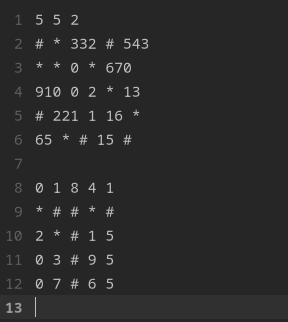
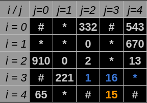
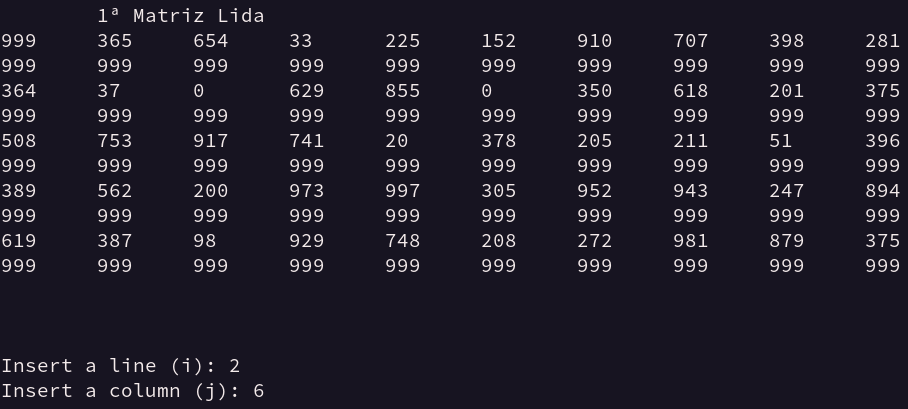

<!--Idea!! CITAR O NÍVIO ZIVIANI-->
<!--DÚVIDAS!!
    1. Pedir um feedback geral tanto do código quanto do readme.
    2. Perguntar se as minhas referências estão sendo realizadas da maneira correta.
    3. Tá grande de mais?
    remember the font: https://www.iconexperience.com/o_collection/search/?q=graph
-->

# O Algoritmo Guloso - Percorrento um Labirinto Recorrente

#### Algoritmos e Estrutura de Dados

#### Compatibilidade e Desenvolvimento
 

  

  
## Introdução
Este repositório apresenta a solução implementada para um desafio da disciplina de Algoritmos e Estruturas de Dados. Há com isso o propósito de testar a implementação de um algoritmo guloso que faça pesquisa em uma matriz. Para melhor entendimento deste trabalho, considere as sentenças à seguir:
- $K$ - Número de matrizes de entrada.

- $N$ - Ordem de uma matriz tal que $N \in \mathbb{Z}$ e $N\geq 0$.

- $i$ - Índice de uma linha que pertence à uma matriz específica, também pode ser abstraído como deslocamento na vertical, tal que $i \geq 0$ e $i \in \mathbb{Z}$.

- $j$ - Índice de uma coluna que pertence à uma matriz específica, também pode ser abstraído como deslocamento na horizontal, tal que $j \geq 0$ e $j \in \mathbb{Z}$.

- $a_{ij}$ - Elemento encontrado quando há deslocamento até a linha de índice $i$ e coluna de índice $j$.

- Nomes de diretórios, ou arquivos serão referênciados da seguinte forma: `Nome.txt` ou `Diretório_2`.

- Nomes de comandos digitados no terminal,funções ou variáveis serão referênciados da seguinte forma: _**touch main.cpp**_, _**make run**_, __**ShowResults()**__, __**variableA**__.

- Para as **Figuras** de **1** à **10**, considere a legenda de cores:

    -   Azul:Uma posição futura possível.</kbd>
    -   Cinza: Uma posição futura impossível.
    -   Laranja: Posição atual ou inicial.
    -   Rosa: Posição futura escolhida.
  
## Objetivo
A problemática proposta incita os alunos da disciplina a desenvolverem um programa que leia $K$ matrizes de ordem $N$. Considerando essa proposição algumas exigências de desenvolvimento solicitadas foram:

- As matrizes deverão estar préviamente organizadas para processamento.
- A pesquisa ou percorrimento na matriz iniciará à partir da entrada de dados do usuário ou de um arquivo. Esta entrada é o ponto de onde caminhada ou pesquisa pela matriz se inicia.

- Os movimentos válidos para deslocamento pela matriz são listados à seguir e visualizados de azul na Figura 1, considerando o ponto de partida atual sendo o elemento colorido de laranja:
    
    - Avançar para a próxima coluna.
    
    - Retroceder a coluna anterior.
    
    - Avançar para a linha de baixo.
    
    - Avançar em diagonal esquerda, ou direita para baixo.

<strong>Figura 1</strong> - Movimentos possíveis    
 

 
Fonte: Construção pelo autor¹.
 
____________________________________________
 ¹Criada usando o Google Sheets, Disponível em <a href="https://docs.google.com/spreadsheets/d/1nbK5ybx7Lwp98y11IScqkPUhSizV1jwG1KyGsdvTEjI/edit?usp=sharing">Planilha</a>.

 

- Os movimentos devem ser realizados em direção às casas adjascentes de maior valor possível. No caso da Figura 1 essa opção representa o elemento em $i=1$ e $j=4$, portanto o próximo movimento se desloca até $a_{14}$.
- Caso haja um valor em comum entre as direções de maior valor, é  necessário que uma regra de caminhamento seja estabelecida. E que esta enquanto padrão seja a melhor decisão de caminhamento.
- Ao ter como posição atual o elemento de uma matriz posicionado na última linha e coluna simultâneamente, ou seja o elemento na coordenada de maior valor referente a $i$ e $j$, tais que, $i,j \in \mathbb{Z}$ onde $  0 \leq i\leq N$ e $0 \leq j \leq N$, considera-se que a matriz foi percorrida até o final com isso o programa recebe uma nova entrada referênte ao ponto inicial de caminhada para a próxima matriz. Caso o programa tenha lido a última matriz, isso não acontece.
  
<!--Prioridade alta-->
## Solução
### Arquivos
Os arquivos para funcionamento do projeto são:
- `input.data` : Um arquivo que armazena na sua primeira linha a ordem das matrizes que estão dispostas nas linhas subsequentes.

<strong>Figura 2</strong> - input.data    
 

 
Fonte: Captura de tel feita pelo autor².
 
____________________________________________
 ²Captura de tela do computador do autor. Disponível em: <a href="https://github.com/jAzz-hub/Greedy_Algorithm/blob/main/img/Imagem2.png">Imagem 2</a>.

 

- `Makefile` : Controla a geração dos executáveis e compilação dos mesmos(FREE SOFTWARE FOUNDATION, GNU make, 2023).
- `functions.cpp` : Contém as funções criadas para execução no `main.cpp`.
- `structures.hpp` : Contém as estruturas e chamadas de bibliotecas utilizadas no programa.
- `main.cpp` : Contém uma série de funções e declaração de variáveis que façam com que a busca pela matriz seja realizada devidamente.
  
### Funcionamento
#### 1. Primeira Leitura do Arquivo
 A leitura das entradas do arquivo `input.data` são realizadas em 2 etapas, na primeira etapa é executada a função _**SizeRecon**_.

 A função SizeRecon é responsável por ler a primeira linha do arquivo de entrada e retornar à alguma variável o valor de $N$, este valor serve para todas as $K$ matrizes contidas no arquivo `input.data`.

#### 2. Segunda Leitura do Arquivo.
Com $N$ armazenada na variável _**size**_ o código, uma estrutura de tamanho $N$ do tipo _**MatrixElement**_ denominada _**FinalMatrix**_ é criada para que os valores do arquivo `input.data` sejam alocados em uma variável. A estrutura do tipo _**MatrixElement**_ nesse caso será uma matriz com variávies do tipo unsigned short int como elementos $a_{ij}$.

Para a leitura das $K$ matrizes um laço percorre o arquivo armazenando cada elemento identificado em uma posição da estrutura _**FinalMatrix**_, essa mesma estrutura é reiniciada assim que: _**MatrixLines**_  =  $N-1$ . Considerando que _**MatrixLines**_ é uma variável criada para armazenar o número de linhas preenchidas com entradas do arquivo.

 
#### 3. Percorrendo a Matriz:

#### 3.1. Localização inicial
Diante do que foi narrado, o programa recebe do usuário as coordenadas de $i$ e $j$ para inicializar a pesquisa através da martriz partindo do elemento $a_{ij}$. A entrada de i e j é requisitada através de _**CoordinateDefinition**_.

#### 3.2. Direções possíveis
O programa usa $a_{ij}$ como posição em que está no presente, ele verifica a resposta para a seguinte pergunta:
- As posições adjascentes correspondem à espaços da memória alocados pela matriz?

A validação citada ocorre através do seguinte modo:

- Criação de hipóteses dentro de variáveis booleanas,sendo o resultádo dessas variáveis é dependente da posição atual.As variáveis booleanas criadas tem os nomes de pontos cardeais em inglês, são elas _**W**_,_**SW**_,_**S**_,_**SE**_,_**E**_ e podem ser verdadeiras ou falsas de maneiras diferentes tornando diversos caminhos possíveis. 

Por fim pode-se abstrair a situação acima nas seguintes ilustrações, considerando que o elemento de cor laranja é o local atual:

<strong>Figura 3</strong> - 5 possíveis caminhos    
 

 
Fonte: Construção pelo autor³.
 
____________________________________________
 ³Criada usando o Google Sheets, Disponível em <a href="https://docs.google.com/spreadsheets/d/1nbK5ybx7Lwp98y11IScqkPUhSizV1jwG1KyGsdvTEjI/edit?usp=sharing">Planilha</a>.

 

#### 3.3. A melhor direção local:
Após analisar as hipóteses, a decisão de qual é o melhor caminho a seguir é feita considerando o $a_{ij}$ de maior valor, enquanto esta posição de maior valor seja diferente da última posição. Isso significa que em nenhum momento o próximo passo pode se o passo anterior, afinal isso faria com que duas casas próximas com o maior valor possível fossem as únicas escolhidas.

Para buscar a maior direção válida, o programa decide quais são os pontos cardeais válidos, à depender disso ele executa uma das seguintes funções possíveis:

- _**FivePossibleWays**_: Verifica qual o maior dentre 5 elementos, tendo uma posição de coordenadas $i$ e $j$ diferentes da posição passada. Exemplo na **Figura 4**.

<strong>Figura 4</strong> - Maior valor entre 5
 

 
Fonte: Construção pelo autor⁴.
 
____________________________________________
 ⁴Criada usando o Google Sheets, Disponível em <a href="https://docs.google.com/spreadsheets/d/1nbK5ybx7Lwp98y11IScqkPUhSizV1jwG1KyGsdvTEjI/edit?usp=sharing">Planilha</a>.

 

- _**SouthEastPossibleWays**_: Verifica qual o maior dentre 3 elementos, tendo uma posição de coordenadas $i$ e $j$ diferentes da posição passada. Estes elementos estão ao Sul, Leste ou Sudeste do $a_{ij}$ atual. Exemplo na **Figura 5**.

<strong>Figura 5</strong> - 3 possíveis caminhos para Sul e Leste.     
 

 
Fonte: Construção pelo autor⁵.
 
____________________________________________
 ⁵Criada usando o Google Sheets, Disponível em <a href="https://docs.google.com/spreadsheets/d/1nbK5ybx7Lwp98y11IScqkPUhSizV1jwG1KyGsdvTEjI/edit?usp=sharing">Planilha</a>.

 

- _**SouthWestPossibleWays**_: Verifica qual o maior dentre 3 elementos, tendo uma posição de coordenadas $i$ e $j$ diferentes da posição passada. Estes elementos estão ao Sul, Oeste ou Sudoeste do $a_{ij}$ atual. Exemplo na **Figura 6**.

<strong>Figura 6</strong> - 3 possíveis caminhos para Sul e Oeste.    
 

 
Fonte: Construção pelo autor⁶.
 
____________________________________________
 ⁶Criada usando o Google Sheets, Disponível em <a href="https://docs.google.com/spreadsheets/d/1nbK5ybx7Lwp98y11IScqkPUhSizV1jwG1KyGsdvTEjI/edit?usp=sharing">Planilha</a>.

 

#### 3.4. Casos Especiais
Existem alguns casos particulares onde teremos os seguintes movimentos:

- Quando a posição atual como $a_{ij}$ tem seus valores de $i = N-1$ e $j =N-1 $, ou seja, quando a posição atual for a última posição.Nesse caso a pesquisa na matriz é finalizada.

<strong>Figura 7</strong> - Casa inicial ou presente é igual casa final.    
 

 
Fonte: Construção pelo autor⁷.
 
____________________________________________
 ⁷Criada usando o Google Sheets, Disponível em <a href="https://docs.google.com/spreadsheets/d/1nbK5ybx7Lwp98y11IScqkPUhSizV1jwG1KyGsdvTEjI/edit?usp=sharing">Planilha</a>.

 

- Quando a posição atual como $a_{ij}$ tem seus valores de $i = N-1$ com  $j$ sendo qualquer valor, ou seja, quando a posição atual está na última linha da matriz. Nesse caso o único movimento possível é avançando em colunas, ou seja de forma que o próximo passo tenha o $i$ constante e o $j=j+1$ até que se chegue à última casa. Isso acontece pelo fato de que ao chegar à última linha realizar um movimento que não siga essas diretrizes resultará na impossibilidade de continuar caminhando sem ter chegado ao final da matriz.

<strong>Figura 8</strong> - Casa inicial ou presente tem $i = N-1$    
 

 
Fonte: Construção pelo autor⁸.
 
____________________________________________
 ⁸Criada usando o Google Sheets, Disponível em <a href="https://docs.google.com/spreadsheets/d/1nbK5ybx7Lwp98y11IScqkPUhSizV1jwG1KyGsdvTEjI/edit?usp=sharing">Planilha</a>.

 

- Em casos de execução das funções: _**SouthWestPossibleWays**_, _**SouthEastPossibleWays**_ ou _**FivePossibleWays**_ onde os valores de duas ou mais casas adjascentes são iguais, haverá sempre preferência pelas casas adjascentes de maior valor na seguinte ordem:
    
    - 1º Escolha do elemento com $i = i+1$ e $j = j$, ou seja, elemento abaixo.
    - 2º Escolha do elemento com $i = i+1$ e $j = j+1$, ou seja, elemento abaixo na diagonal direita.
    - 3º Escolha do elemento com $i = i+1$ e $j = j$, ou seja, à direita.
    - 4º Escolha do elemento com $i = i+1$ e $j = j-1$, ou seja, à direita.
    

<strong>Figura 9</strong> - Casas adjascentes à inical com valor igual    
 

 
Fonte: Construção pelo autor⁹.
 
____________________________________________
 ⁹Criada usando o Google Sheets, Disponível em <a href="https://docs.google.com/spreadsheets/d/1nbK5ybx7Lwp98y11IScqkPUhSizV1jwG1KyGsdvTEjI/edit?usp=sharing">Planilha</a>.

 

## Implementação
Em função de representar é realizado pelo algoritmo diante da entrada no arquivo <a href="dataset/input.data">`input.data`</a>, observe as imagens abaixo. Considere que nas saídas, números diferentes de 999 repersentam a ordem da caminhada realizada, sendo 999 uma forma de representar localizações fora do trajeto:

<strong>Figura 10</strong> - Entrada e saída de dados Matriz 1
 

 
  
<strong>Figura 11 - </strong>
Saída de dados Matriz 1
 

 
 
<strong>Figura 12 - </strong>
Entrada de dados Matriz 2
 

 
 
<strong>Figura 13 - </strong>
Saída de dados Matriz 2
 

 
 
<strong>Figura 14 - </strong>
Saída de dados da Soma Global
 

 
 
Fonte: Captura de tela da compilação e execução realizada pelo autor ¹⁰.
 
____________________________________________
 ¹⁰Criada Pela Compilação do código fonte(ordem de entradas:  2 e 6, 2 e 2), Disponível em <a href="./src">Código Fonte</a>.

 

## Reflexões e Aprendizados

### O que é um Algoritmo Guloso?
"Um algoritmo guloso sempre faz a escolha que parece ser a melhor no momento em questão. 
Isto é, faz uma escolha localmente ótima, na esperança de que essa escolha leve a uma solução globalmente ótima." 
 
<strong>Algoritmos: teoria e prática, de Thomas H. Cormen, Charles E. Leiserson, Ronald L. Rivest e Clifford Stein, tradução da 3ª edição</strong>

### Reavaliando a Implementação de um Algoritmo Guloso
Com o intuito de preparar os alunos para a disciplina de Algoritmos e Estruturas de Dados dentro de um contexto onde os mesmos tivessem de ser avaliados em um período limitado de tempo, o desenvolvimento do desafio será avaliado diante da documentação e tentativa de construir um algoritmo guloso que resolvesse o problema apresentado.

Contudo, é importante ressaltar que a implementação de algoritmos gulosos necessita de um estudo aprofundado em outros cenários antes de ser implementado.

Considerando isso, são propostos por Cormen(2012) os Elementos da Estratégia Gulosa, ou seja, a projeção de algoritmos gulosos conta com a seguinte sequência de etapas:

1. "Projetar o problema [...] como um problema no qual fazemos uma escolha e ficamos com um único subproblema para resolver"(CORMEN, 2012, p.354).  
2. "Provar que sempre existe uma solução ótima para o problema original que usa a escolha gulosa, de modo que a escolha gulosa é sempre segura"(CORMEN, 2012, p.354)."  
3. "Demonstrar subestrutura ótima, mostrando que, tendo feito a escolha gulosa, o que resta é o subproblema com a seguinte propriedade: se combinamos uma solução ótima para o subproblema com a escolha que fizemos, chegamos a uma solução ótima para o problema original"(CORMEN, 2012, p.354).  

 
 
## Compilação e Execução
Para compilação e execução do código é necessário que seja criado um arquivo Makefile. Para uso deste arquivo da forma correta, siga as diretrizes de execução abaixo:

<table>

<tr>
<td colspan = '1'><strong>Comandos</strong></td>
<td align = "center" colspan = '1'><strong>Funções</strong></td>
</tr>

<tr>
<td align="center"><strong><i>make clean</i></strong>
</td>
<td align="center">Deleta o arquivo executável e todos os arquivos objetos do diretório. (FREE SOFTWARE FOUNDATION, GNU make, 2023)</td>
</tr>
<tr>
<td align="center"><strong><i>make</i></strong></td>
<td align="center">Compila diferentes partes do programa através do g++ e cria um arquivo executável na pasta build. </td>
</tr>
<tr>
<td align="center"><strong><i>make run</i></strong></td>
<td align="center">Executa o programa da pasta build após a realização da compilação. (PIRES, MICHEL, 2023)</td>
</tr>
</table>

## Ambiente de desenvolvimento:
O código foi desenvolvido e testado no seguinte ambiente de desenvolvimento:

<table>
<tr>
<td colspan = '1' align="center"><strong>Peças</strong></td>
<td align = "center" colspan = '1'><strong>Especificações</strong></td>
</tr>

<tr>
<td align="center"><strong><i>Processador</i></strong>
</td>
<td align="center">Intel(R) Core(TM) i5-3340M CPU @ 2.70GHz</td>
</tr>
<tr>
<td align="center"><strong><i>Memória RAM</i></strong></td>
<td align="center">8 GB </td>
</tr>
<tr>
<td align="center"><strong><i>Sistema Operacional</i></strong></td>
<td>Linux fedora 6.2.7-100.fc36.x86_64 </td>
</tr>
</table>

  
## Referências <!--Idea!! CITAR O NÍVIO ZIVIANI-->

[1] CORMEN, T. H. et al. Introduction to Algorithms, third edition. [s.l.] MIT Press, 2009. Acessador em 20 de Março de 2023.

[2] PIRES, MICHEL - Repositório GitHub, @mpiress: GenerateDataToMatrix - Disponível em: https://github.com/mpiress/GenerateDataToMatrix/blob/main/src/mat.h. Acessado em 15 de Março de 2023.

[3] GNU make. Disponível em: <https://www.gnu.org/software/make/manual/make.html>. Acessado em 21 de Março de 2023.

[4] GNU Make. Disponível em: <https://www.gnu.org/software/make/>. Acesso em: mar. 23DC.

‌

‌

## Contato
 

 
 

 
 

<a style="color:black" href="mailto:michel@cefetmg.br?subject=[GitHub]%20Source%20Dynamic%20Lists">
✉️ <i>joaogu.2001@gmail.com</i>
</a>

